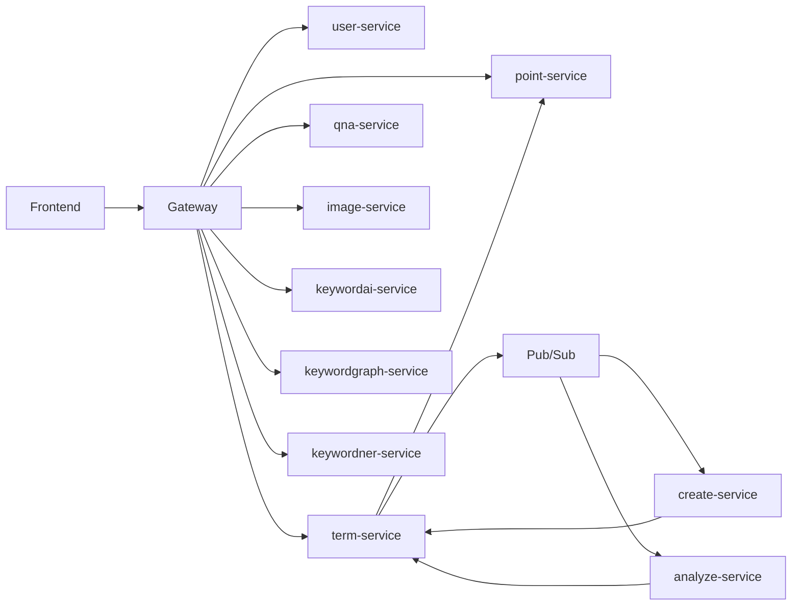

# AIVLE_BIG_PROJECT

금융 약관 생성, 리스크 분석, 키워드 시각화, 이미지 기반 문구 분석을 제공하는 MSA 기반 플랫폼입니다.  
현재 구조는 Gateway 단일 진입, 도메인 서비스 분리, AI worker 비동기 처리, Cloud Run 배포를 기준으로 정리되어 있습니다.

배포된 프론트 주소:

- [front-service](https://front-service-902267887946.us-central1.run.app)

## 핵심 기능

- AI 기반 약관 초안 생성
- 업로드 약관 조회, 편집, 버전 관리
- 약관 리스크 분석 및 수정 제안
- 키워드 추출, 엔터티 추출, 관계 그래프 시각화
- 이미지 기반 약관 문구 분석
- 포인트 조회, 충전, 차감 이력 관리
- Q&A 게시판
- Firebase Auth 기반 로그인과 사용자 프로필 관리

## 현재 아키텍처



### 구조 요약

- 외부 클라이언트는 `Gateway`만 호출합니다.
- `user-service`, `point-service`, `term-service`, `qna-service`가 도메인 책임을 나눠 가집니다.
- 무거운 AI 생성/분석 작업은 `term-service`가 Pub/Sub 메시지를 발행하고, Cloud Run worker인 `create-service`, `analyze-service`가 push subscription으로 직접 깨어나 처리합니다.
- 키워드/이미지 기능은 Gateway 뒤의 별도 서비스로 유지됩니다.

## 서비스 역할

| 디렉터리 | 역할 |
| --- | --- |
| `frontend` | React 프론트엔드 |
| `gateway` | 외부 단일 진입점, 라우팅, 인증 헤더 전달 |
| `user` | 사용자 프로필 조회/저장, Firebase Auth 검증 |
| `point` | 포인트 잔액, 충전, 이력, 예약/확정/취소 |
| `term` | 약관 CRUD, 업로드, 비동기 AI 작업 오케스트레이션 |
| `qna` | 질문/답변 게시판 |
| `ai` | 약관 생성 worker |
| `analyze_ai` | 약관 분석 worker |
| `image_ai` | 이미지 기반 문구 분석 |
| `keywords_ai` | 키워드 분석 |
| `keywords-graph` | 키워드 관계 그래프 |
| `keywords-ner` | 키워드 엔터티 추출 |
| `docs` | 구조 및 운영 문서 |
| `scripts` | 배포 및 운영 스크립트 |

## 서비스 경계

자세한 서비스 소유권과 호출 흐름은 아래 문서에 정리되어 있습니다.

- [docs/msa-service-boundaries.md](C:\Users\Administrator\Desktop\Bigproject\AIVLE_BIG_PROJECT\docs\msa-service-boundaries.md)

핵심 원칙:

- 프론트는 Firestore `users`를 직접 읽거나 쓰지 않습니다.
- 포인트 변경은 `point-service`만 수행합니다.
- AI worker는 포인트를 직접 차감하지 않습니다.
- 장시간 작업은 동기 HTTP가 아니라 Pub/Sub 기반 비동기 Job으로 처리합니다.

## 비동기 AI 처리 흐름

### 약관 생성

1. 프론트가 `term-service`에 Job 생성을 요청합니다.
2. `term-service`가 `point-service`에 포인트 예약을 요청합니다.
3. `term-service`가 Pub/Sub에 생성 작업 메시지를 발행합니다.
4. `terms-create-request-sub` push subscription이 `create-service`를 직접 호출합니다.
5. `create-service`가 결과를 `term-service` 내부 callback으로 전달합니다.
6. `term-service`가 Job 상태를 완료로 바꾸고 포인트를 확정합니다.

### 약관 분석

1. 프론트가 `term-service`에 분석 Job 생성을 요청합니다.
2. `term-service`가 `point-service`에 포인트 예약을 요청합니다.
3. `term-service`가 Pub/Sub에 분석 작업 메시지를 발행합니다.
4. `terms-analyze-request-sub` push subscription이 `analyze-service`를 직접 호출합니다.
5. `analyze-service`가 결과를 `term-service` 내부 callback으로 전달합니다.
6. `term-service`가 Job 상태를 완료로 바꾸고 포인트를 확정합니다.

## Gateway 라우팅

현재 기준 주요 공개 경로는 아래와 같습니다.

- `/terms/**` -> `term-service`
- `/points/**`, `/api/points/**` -> `point-service`
- `/api/users/**`, `/api/auth/**`, `/users/**` -> `user-service`
- `/qna/**` -> `qna-service`
- `/image/**` -> `image-service`
- `/keywords/**` -> `keywordai-service`
- `/graph/**` -> `keywordgraph-service`
- `/ner/**` -> `keywordner-service`

## 운영 배포

현재 운영은 Google Cloud Run 기준입니다.

- 공개 진입:
  - `front-service`
  - `gateway-service`
- 도메인 서비스:
  - `user-service`
  - `point-service`
  - `term-service`
  - `qna-service`
- AI worker:
  - `create-service`
  - `analyze-service`
- 기능성 서비스:
  - `image-service`
  - `keywordai-service`
  - `keywordgraph-service`
  - `keywordner-service`

재배포 자동화 스크립트:

- [scripts/redeploy-cloudrun-msa.ps1](C:\Users\Administrator\Desktop\Bigproject\AIVLE_BIG_PROJECT\scripts\redeploy-cloudrun-msa.ps1)

## 로컬 실행

### 필수 도구

- Java 11
- Maven
- Node.js 18 이상
- Python 3.10 이상
- Docker

### 프론트 실행

```bash
cd frontend
npm install
npm start
```

### Gateway 실행

```bash
cd gateway
mvn spring-boot:run
```

기본 포트:

- `gateway`: `8088`

### Spring 서비스 실행

```bash
cd term
mvn spring-boot:run
```

```bash
cd point
mvn spring-boot:run
```

```bash
cd qna
mvn spring-boot:run
```

```bash
cd user
mvn spring-boot:run
```

기본 포트:

- `term`: `8083`
- `point`: `8085`
- `qna`: `8086`
- `user`: `8084`

### Python 서비스 실행

`ai`

```bash
cd ai
pip install -r requirements.txt
python Create_Terms.py
```

`analyze_ai`

```bash
cd analyze_ai
pip install -r requirements.txt
python analyze_terms.py
```

`image_ai`

```bash
cd image_ai
pip install -r requirements.txt
python main.py
```

`keywords-ner`

```bash
cd keywords-ner
pip install -r requirements.txt
python keywords.py
```

`keywords-graph`

```bash
cd keywords-graph
pip install -r requirements.txt
python network.py
```

`keywords_ai`

```bash
cd keywords_ai
pip install -r requirements.txt
python main.py
```

## 주요 환경변수

### 프론트

- `REACT_APP_GATEWAY_BASE_URL`
- `REACT_APP_TERM_API_BASE_URL`
- `REACT_APP_USER_API_BASE_URL`
- `REACT_APP_POINT_API_BASE_URL`
- `REACT_APP_QNA_API_BASE_URL`
- `REACT_APP_ANALYZE_API_BASE_URL`
- `REACT_APP_CREATE_API_BASE_URL`
- `REACT_APP_IMAGE_API_BASE_URL`
- `REACT_APP_KEYWORD_AI_API_BASE_URL`
- `REACT_APP_KEYWORD_GRAPH_API_BASE_URL`
- `REACT_APP_KEYWORD_NER_API_BASE_URL`
- `REACT_APP_API_TIMEOUT_MS`
- `REACT_APP_FIREBASE_*`

### 백엔드 / worker

- `SPRING_PROFILES_ACTIVE`
- `FRONTEND_URL`
- `INTERNAL_CALLBACK_TOKEN`
- `POINT_SERVICE_BASE_URL`
- `TERM_SERVICE_URL`
- `POINT_SERVICE_URL`
- `GOOGLE_APPLICATION_CREDENTIALS`
- `TERMS_VECTOR_BUCKET`
- `ASYNC_AI_ENABLED`

## 참고

- 현재 구조는 예전 Kafka 기반 이벤트 흐름을 줄이고, 핵심 장시간 AI 작업을 Pub/Sub 기반 worker 구조로 정리한 상태입니다.
- 운영 환경 URL과 프론트 환경변수는 [frontend/.env.production](C:\Users\Administrator\Desktop\Bigproject\AIVLE_BIG_PROJECT\frontend\.env.production) 기준으로 맞춰져 있습니다.
- 상세 서비스 경계는 [docs/msa-service-boundaries.md](C:\Users\Administrator\Desktop\Bigproject\AIVLE_BIG_PROJECT\docs\msa-service-boundaries.md)를 우선 기준으로 보면 됩니다.
